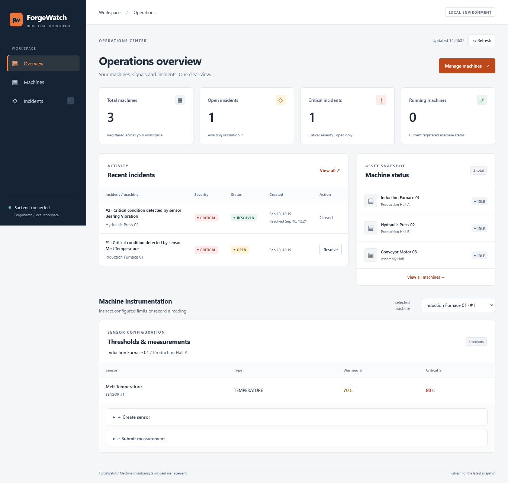
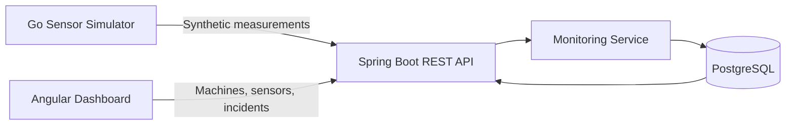

# ForgeWatch

Industrial Machine Monitoring and Incident Management Platform.

ForgeWatch models a small end-to-end industrial monitoring workflow:

```text
synthetic sensor reading
        ↓
measurement
        ↓
threshold evaluation
        ↓
alert
        ↓
incident
        ↓
resolution
```

The project combines a Java/Spring Boot backend, PostgreSQL, an Angular dashboard, a small Go sensor simulator, Docker, and GitHub Actions CI.

> ForgeWatch is a portfolio project. Sensor readings and thresholds are synthetic demo values and are not calibrated industrial process limits.



## Architecture



The Go simulator acts as an independent external data producer. It communicates with ForgeWatch only through the REST API and never accesses PostgreSQL directly.

The Angular dashboard is a separate client of the same backend.

## Tech Stack

| Area | Technology |
| --- | --- |
| Backend | Java 21, Spring Boot, Spring Web, Spring Data JPA |
| Database | PostgreSQL 17 |
| Frontend | Angular, TypeScript, Signals, Reactive Forms |
| Sensor simulation | Go |
| Containers | Docker, Docker Compose |
| CI | GitHub Actions |
| Backend testing | JUnit, Spring Boot Test, PostgreSQL integration tests |
| Frontend testing | Playwright |

## Domain Model

```text
Machine
  └── Sensor
        └── Measurement
              └── Alert
                    └── Incident
```

Each sensor contains a warning threshold and a critical threshold.

The backend evaluates every submitted measurement:

```text
value < warning threshold
    → measurement stored

value >= warning threshold
    → measurement + WARNING alert

value >= critical threshold
    → measurement + CRITICAL alert
    → OPEN incident if the machine does not already have one
```

Resolving an incident changes its status to `RESOLVED` and records `resolvedAt`.

Monitoring decisions belong to the backend. The frontend and simulator only submit or display data.

## Main Features

- Register machines and locations
- Configure sensors and thresholds
- Submit sensor measurements through REST
- Evaluate warning and critical threshold conditions
- Generate alerts automatically
- Create incidents for critical conditions
- Prevent duplicate open incidents for the same machine
- Resolve incidents and retain incident history
- Browse machines, sensors, and incidents
- Display operational KPIs in an Angular dashboard
- Generate synthetic measurements with a Go simulator
- Run PostgreSQL and the backend with Docker Compose
- Run the simulator through an optional Docker Compose profile
- Validate backend, frontend, and simulator with GitHub Actions

## REST API

| Method | Endpoint | Purpose |
| --- | --- | --- |
| `GET` | `/api/machines` | List machines |
| `POST` | `/api/machines` | Create a machine |
| `GET` | `/api/machines/{id}` | Get one machine |
| `GET` | `/api/machines/{machineId}/sensors` | List sensors for a machine |
| `POST` | `/api/machines/{machineId}/sensors` | Create a sensor |
| `GET` | `/api/sensors/{id}` | Get one sensor |
| `POST` | `/api/sensors/{sensorId}/measurements` | Submit a measurement |
| `GET` | `/api/incidents` | List incidents |
| `GET` | `/api/incidents/open` | List open incidents |
| `GET` | `/api/incidents/{id}` | Get one incident |
| `PATCH` | `/api/incidents/{id}/resolve` | Resolve an incident |

Supported sensor types:

```text
TEMPERATURE
PRESSURE
VIBRATION
POWER
COOLING_FLOW
```

Supported machine states:

```text
RUNNING
IDLE
MAINTENANCE
OFFLINE
```

New machines currently start in `IDLE`.

## Run with Docker

### Requirements

- Docker
- Docker Compose v2+

From the repository root:

```bash
docker compose config
docker compose build
docker compose up -d
docker compose ps
```

The standard stack starts:

```text
PostgreSQL  → localhost:5432
Spring Boot → localhost:8080
```

PostgreSQL has a healthcheck, and the backend starts after the database becomes healthy.

Smoke-test the backend:

```bash
curl --fail --show-error http://localhost:8080/api/machines
```

On Windows PowerShell, `curl.exe` can be used explicitly:

```powershell
curl.exe --fail --show-error http://localhost:8080/api/machines
```

The backend is available at:

```text
http://localhost:8080
```

Use `/api/machines` or another API endpoint rather than `/`, because the application does not expose a root endpoint.

Stop the stack while keeping database data:

```bash
docker compose down
```

Reset the local database volume:

```bash
docker compose down -v
```

Use `down -v` only when you intentionally want to delete the local ForgeWatch database.

## Optional Docker Sensor Simulator

The simulator is excluded from normal `docker compose up` so that starting the application does not continuously generate measurements.

First create a machine and sensor and note the sensor ID.

Run one synthetic measurement:

```bash
docker compose --profile simulator run --rm \
  -e FORGEWATCH_SENSOR_ID=1 \
  -e FORGEWATCH_MODE=one-shot \
  -e FORGEWATCH_MIN_VALUE=20 \
  -e FORGEWATCH_MAX_VALUE=30 \
  simulator
```

Replace sensor ID `1` with an existing sensor ID.

Run continuously:

```bash
docker compose --profile simulator run --rm \
  -e FORGEWATCH_SENSOR_ID=1 \
  -e FORGEWATCH_INTERVAL=5s \
  -e FORGEWATCH_MIN_VALUE=20 \
  -e FORGEWATCH_MAX_VALUE=30 \
  simulator
```

Inside Docker, the simulator uses the Compose service name `backend`:

```text
Go simulator
    ↓ HTTP
backend:8080
    ↓ JPA
PostgreSQL
```

Generated readings are persisted like any other measurement and can therefore trigger alerts and incidents.

## Local Development

### Backend

Start PostgreSQL:

```bash
docker compose up -d postgres
```

Then run the backend:

```bash
cd backend/forgewatch-backend
./mvnw spring-boot:run
```

Windows PowerShell:

```powershell
cd backend\forgewatch-backend
.\mvnw.cmd spring-boot:run
```

The backend connects to PostgreSQL on `localhost:5432` in local development.

### Frontend

Keep the backend running, then:

```bash
cd frontend
npm ci
npm start
```

Open:

```text
http://localhost:4200
```

The Angular development proxy forwards `/api` requests to the backend on port `8080`, so no separate development CORS configuration is required.

### Go Simulator

From the `simulator` directory:

```bash
go run . -sensor-id 1 -mode one-shot -min 20 -max 30
```

Continuous mode:

```bash
go run . -sensor-id 1 -interval 5s -min 20 -max 30
```

The simulator generates bounded synthetic readings and uses only the Go standard library.

## Testing

### Backend

The backend currently contains 44 tests covering areas including:

- API validation and DTO responses
- Threshold boundary behavior
- Alert and incident creation
- Incident resolution
- PostgreSQL persistence
- Transaction rollback
- Concurrent requests
- Duplicate-open-incident prevention

With PostgreSQL running:

```bash
cd backend/forgewatch-backend
./mvnw test
```

Windows PowerShell:

```powershell
.\mvnw.cmd test
```

The integration tests use PostgreSQL rather than replacing it with an in-memory database.

### Frontend

Production build:

```bash
cd frontend
npm ci
npm run build
```

Playwright validation:

```bash
npx playwright test
```

The persistent live workflow is opt-in because it creates records in the local database:

```powershell
$env:FORGEWATCH_LIVE_TEST="1"
npx playwright test
Remove-Item Env:FORGEWATCH_LIVE_TEST
```

### Go Simulator

```bash
cd simulator
gofmt -l *.go
go vet ./...
go test ./...
go build ./...
```

## Continuous Integration

GitHub Actions validates pull requests targeting `main` and pushes to `main`.

The workflow contains three independent jobs:

```text
Backend - Java 21
    PostgreSQL 17 service
    Maven test suite

Frontend - Angular
    npm ci
    production build

Simulator - Go
    formatting check
    go vet
    go test
    go build
```

This keeps failures isolated by component and ensures the backend is tested against PostgreSQL.

## Project Structure

```text
forgewatch/
├── .github/
│   └── workflows/
│       └── ci.yml
├── backend/
│   └── forgewatch-backend/
│       ├── src/
│       ├── Dockerfile
│       └── pom.xml
├── frontend/
│   ├── src/
│   ├── e2e/
│   ├── package.json
│   └── proxy.conf.json
├── simulator/
│   ├── main.go
│   ├── config.go
│   ├── generator.go
│   ├── simulator.go
│   ├── Dockerfile
│   └── go.mod
├── docs/
│   └── images/
│       └── dashboard-overview.png
├── docker-compose.yml
└── README.md
```

## Design Decisions

### PostgreSQL for integration testing

Persistence tests use PostgreSQL so database behavior is validated against the same database technology used by the application.

### Backend-owned monitoring logic

Threshold evaluation and incident creation happen in Spring Boot. Clients do not decide alert severity.

### DTOs at the REST boundary

The API uses request and response DTOs instead of exposing JPA entities and Hibernate internals directly.

### Independent Go data producer

The simulator behaves like an external source and communicates only through HTTP, keeping data generation separate from monitoring logic.

### Optional simulator container

The simulator uses a Docker Compose profile so the normal application startup remains deterministic and does not automatically pollute the database.

### Small modular architecture

ForgeWatch intentionally remains a focused application. Kafka, Kubernetes, microservices, machine learning, and WebSockets are not added where the current scope does not require them.

## Current Scope and Limitations

ForgeWatch focuses on the monitoring and incident lifecycle rather than production deployment.

Not currently implemented:

- Authentication and authorization
- Measurement-history visualization
- Real-time WebSocket or streaming updates
- Pagination for growing datasets
- Automated database migrations
- Production secret management
- Industrial protocol integration
- Calibrated physical process simulation
- Predictive maintenance or machine-learning models

The current Docker Compose credentials and Hibernate schema-update behavior are intended for local development. A production deployment would require proper secret management, database migrations, backups, and deployment-specific hardening.

## Purpose

ForgeWatch was built to explore a complete industrial monitoring workflow across multiple layers:

```text
external data generation
        ↓
REST API
        ↓
business rules
        ↓
database persistence
        ↓
incident lifecycle
        ↓
operations dashboard
        ↓
containerization and CI
```

The emphasis is not only on CRUD operations, but on connecting an external data source to backend business logic and making the resulting operational state visible and manageable.
